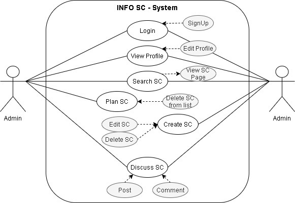
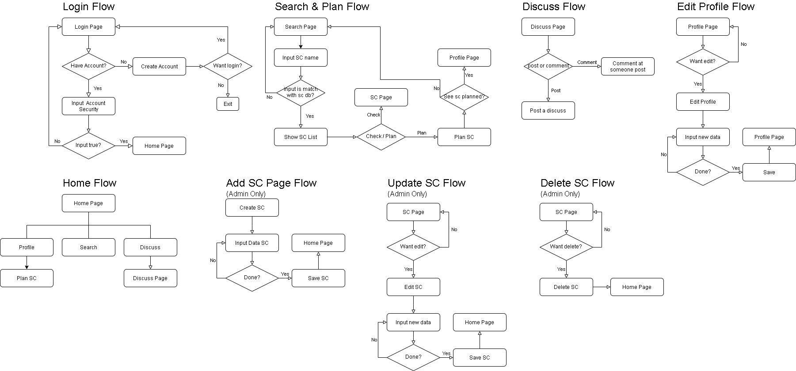
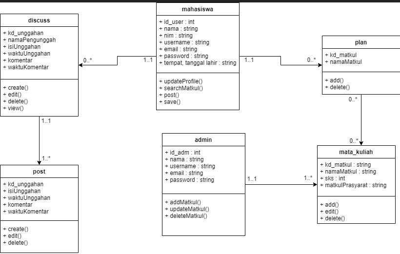
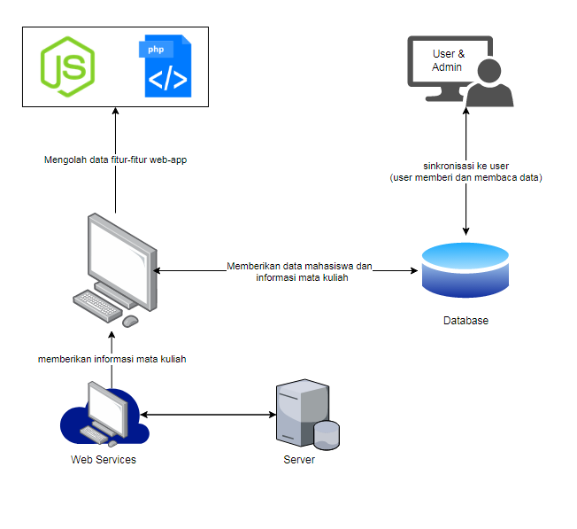

 

  
  <h3 align="center">SC-INFO</h3>

  

    Paralel 1 Kelompok 2
  

  
 Asprak : Indah Puspita, Qoriatul Khairunnisa 

<!-- TABLE OF CONTENTS -->

  
<h2 style="display: inline-block">Nama Anggota</h2>

  <ol>
    <li>
      Arhammirza Ibrahim (G64190007) -> Ketua, full stack, tampan people
    </li>
    <li>
      Aryo Aditya (G64190008) -> BackEnd
    </li>
    <li>Sigit Raditya Pangestu (G64190071) -> FrontEnd</li>
    <li>Yosar Awandi Porseda (G64190076) -> Quality Assurance (pasang nama doang sebenernya)</li>
  </ol>

<!-- ABOUT THE PROJECT -->
## Deskripsi Singkat Aplikasi

SC-Info adalah aplikasi berbasis web yang berguna untuk memudahkan
mahasiswa mendapatkan informasi terkait mata kuliah supporting course. Aplikasi ini
memiliki fitur ....(fiturnya yg jadi apa aja bro?).

## User Analysis
### User Story
* Sebagai seorang mahasiswa yang sedang mencari informasi lengkap mata kuliah SC, agar dapat masuk ke laman web SC Info, saya dapat login terlebih dahulu.
* Sebagai seorang mahasiswa, agar dapat menemukan matkul sc dengan mudah, saya dapat menggunakan fitur search SC
* Sebagai seorang mahasiswa, agar bisa menyimpan matkul sc tsb berupa list, saya dapat menekan tombol "Plan" pada sc tersebut
* Sebagai mahasiswa, agar dapat mencari mata kuliah yang cocok untuk dimasukkan ke dalam krs, saya dapat masuk ke menu rekomendasi SC
* Sebagai mahasiswa, agar dapat berdiskusi mengenai sc dengan pengguna lainnya, saya dapat menggunakan fitur diskusi

## Spesifikasi teknis lingkungan pengembangan
### Software
* Framework : Laravel dan Boostrap
* Database : MySQL
* Server : Apache
* Text Editor : Visual Studio Code
### Hardware
* Processor : Intel(R) Core(TM) i5-3230M CPU @ 2.60GHz 2.60 GHz
* Graphics Card : Intel HD 4000 Graphic
* RAM : 8 GB
### Tech Stack
Html, CSS, PHP, MySQL
## Hasil dan pembahasan
### 1. Use Case Diagram
 

  
  
Use Case Diagram

### 2. Activity Diagram
 

  
  
Activity Diagram

### 3. Class Diagram
 

  
  
Class Diagram

### 4. Entity Relationship Diagram
lupa blum keupload :)

### 5. Arsitektur sistem
 

  
  
Arsitektur diagram

### 6. Fungsi utama yang dikembangkan
posting, search, komen 
### 7. Fungsi CRUD

## Hasil implementasi
### Screenshot sistem
(gambarnya ntar diapasang)
### Link aplikasi (jika sudah di deploy)
(blum deploy kn?)
## Testing (Test cases)
### Positive Cases
(emmmm)
### Negative Cases (Optional, jika ada jadi nilai tambah)
## Saran untuk pengembangan selanjutnya
(mohon sarannya)
